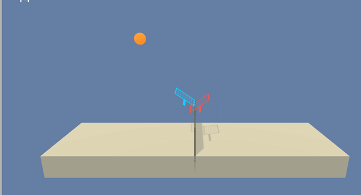
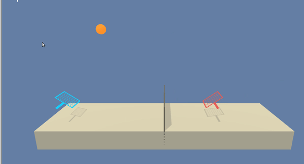

# Project 3: Collaboration and Competition

| Agent with untrained random actions | Trained Agent | 
|--------------------------------------|--------------------------------------|
|  |  | 

## Introduction

This project includes a training approach for the Unity [Tennis](https://github.com/Unity-Technologies/ml-agents/blob/master/docs/Learning-Environment-Examples.md#tennis) environment.

In this environment, two agents play tennis against each other. Each agent controls a racket and has to bounce the ball over the net. Therefore it's the goal for each agent to **maintain the the game as long as possible without letting the ball hit the ground**.

When the agent play the ball over the net, it returns a reward of +0.1.
If the ball hits the ground or goes out of bounds of the game, the agent gets a reward of -0.01.

The observation space consists of 8 variables corresponding to the position and velocity of the ball and racket. Each agent receives its own, local observation. Two continuous actions are available, corresponding to movement toward (or away from) the net, and jumping.

## Goal

The environment is considered solved, when the average (over 100 episodes) of those scores is at least +0.5.

The training will be done in a headless python environment instead of a jupyter notebook as it will take several hours.

## Included important files

  * `run_trained_sac_models.ipynb`: Compare visually a random action SAC-Agent with a trained Agent using Unity environment with visual frontend -> [Linux Environment](https://s3-us-west-1.amazonaws.com/udacity-drlnd/P3/Tennis/Tennis_Linux.zip)
  * `train_sac_headless.py`: Training script to run on a headless server with non visual Unity environment -> [Linux Headless Environment](https://s3-us-west-1.amazonaws.com/udacity-drlnd/P3/Tennis/Tennis_Linux_NoVis.zip)
  * `multi_sac_agent.py`: includes the class for the agent, that initialises the models and acts and learns (with the initialised models) against the given Unity environment
  * `model.py`: has the Pytorch-based architectures for the Actor, the Value and the Critic network
  * `*.pth`: the checkpoint weights for the the models that reached a consecutive reward of +0.5 over 100 episodes
  * `last_scores.txt`: list of numbers which represents the reward development over all training episodes
  
## How to run

### Training

To train your Multi-Agent SAC Agent, run:

  * `python train_sac_headless.py`
  
### See acting agent

To check how the agent is acting in the Reacher environment with visual feedback and check your trained model weights:

  * Run the cells in `run_trained_sac_models.ipynb` notebook

## Installation

### Unity Environment

1. Download the environment from one of the links below.  You need only select the environment that matches your operating system:

    - Linux: [click here](https://s3-us-west-1.amazonaws.com/udacity-drlnd/P3/Tennis/Tennis_Linux.zip)
    - Linux (headless) [click here](https://s3-us-west-1.amazonaws.com/udacity-drlnd/P3/Tennis/Tennis_Linux_NoVis.zip)
    - Mac OSX: [click here](https://s3-us-west-1.amazonaws.com/udacity-drlnd/P3/Tennis/Tennis.app.zip)
    - Windows (32-bit): [click here](https://s3-us-west-1.amazonaws.com/udacity-drlnd/P3/Tennis/Tennis_Windows_x86.zip)
    - Windows (64-bit): [click here](https://s3-us-west-1.amazonaws.com/udacity-drlnd/P3/Tennis/Tennis_Windows_x86_64.zip)

2. Place the included binary file that ends with `x.86_64` (as I'm using 64-bit OS) in a location that is reachable from your training code. 

3. This unity environment can only be run with a Python Version `>= 3.6`.

### Python Environment

1. Install a Python 3.6 Environment on your host (the Unity Environment will only work with Python 3.6)
2. Create a virtual environment:`virtualenv -p /usr/bin/python3.6 your_environment` and activate it `source your_environment/bin/activate`
3. (When in activated virtual environment) Install the necessary packages from the requirements in this repo: `pip install -r requirements.txt`  

